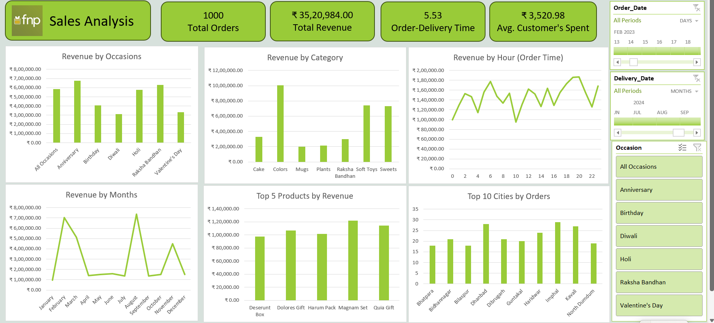

# 🌸 FNP Sales Analysis | Excel Dashboard Project

<div align="center">


### Transforming raw gifting data into actionable business intelligence
**1,000 Orders · ₹35.2L Revenue · 3 Tables · 10 Business Questions Answered**

[📊 Dashboard](#-dashboard) • [⚙️ Data Model](#️-data-model) • [🧹 Power Query](#-power-query--etl) • [💡 Insights](#-key-insights--recommendations)

</div>

---

## 📌 About This Project

**Ferns and Petals (FNP)** is India's leading gifting brand delivering flowers, cakes, and gifts for occasions like Diwali, Raksha Bandhan, Holi, Valentine's Day, Birthdays, and Anniversaries.

This is a complete end-to-end analytics project where I:
- Ingested **3 raw CSV files** (Orders, Customers, Products) into Excel via Power Query
- Built a **star schema data model** in Power Pivot with proper relationships
- Created **DAX measures** for all KPIs
- Designed an **interactive Excel dashboard** with slicers and pivot charts
- Derived **5 actionable business recommendations** from the analysis

> This project simulates a real analyst workflow — from messy raw data to a boardroom-ready dashboard.

---

## 📊 Dashboard



### Dashboard Features
- **4 KPI cards** — Total Orders, Revenue, Avg Delivery Time, Avg Customer Spend
- **6 interactive charts** — Occasions, Category, Monthly trend, Hourly pattern, Top Products, Top Cities
- **3 slicers** — Filter by Occasion, Order Date, Delivery Date
- **Real-time cross-filtering** — clicking any chart filters the entire dashboard

---

## ⚙️ Data Model


Three source tables were connected in Power Pivot using a **star schema**:

| Table | Type | Key Columns |
|---|---|---|
| `order data` | Fact | Order_ID, Customer_ID, Product_ID, Quantity, Order_Date, Order_Time, Delivery_Date, Delivery_Time, Location, Occasion |
| `customer data` | Dimension | Customer_ID, Name, City, Contact_Number, Email, Gender, Address |
| `products data` | Dimension | Product_ID, Product_Name, Category, Price (INR), Occasion, Description |

### Relationships
```
customer data (Customer_ID) ──1──────*── order data (Customer_ID)
products data (Product_ID)  ──1──────*── order data (Product_ID)
```

Both are **one-to-many** relationships — one customer/product maps to multiple orders — exactly like a production database schema.

---

## 🧹 Power Query — ETL


All data cleaning was done inside Power Query before loading into the data model. Applied steps on the `order data` query:

| Step | What I Did |
|---|---|
| **Source** | Imported raw CSV file |
| **Navigation** | Selected the correct sheet/table |
| **Imported CSV** | Loaded Orders, Customers, Products as separate queries |
| **Promoted Headers** | Set first row as column headers |
| **Changed Type** | Assigned correct data types (Date, Time, Text, Number) |
| **Inserted Month Name** | Extracted month name from `Order_Date` → new column `Month_Name` |
| **Inserted Hour** | Extracted hour from `Order_Time` → new column `Hour` |
| **Added Custom** | Calculated `no of days deliver` = `Delivery_Date` − `Order_Date` |
| **Merged Queries** | Joined `products data` into `order data` on `Product_ID` |
| **Expanded products data** | Pulled `Price (INR)` column from the merged products table |

> **Result:** A clean, fully enriched `order data` table with 14 columns and 1,000 rows — ready for pivot analysis.

---

## 📐 DAX Measures

Custom measures created in Power Pivot:

```dax
Total Revenue       = SUM('order data'[products data.Price (INR)])

Total Orders        = COUNTROWS('order data')

Avg Delivery Days   = AVERAGE('order data'[no of days deliver])

Avg Customer Spend  = DIVIDE([Total Revenue], [Total Orders])
```

---

## 📋 Business Questions & Answers

| # | Question | Answer |
|---|---|---|
| 1 | Total Revenue | ₹35,20,984 |
| 2 | Avg Order & Delivery Time | 5.53 days |
| 3 | Monthly Sales Performance | Peaks in March (Holi) & July (Raksha Bandhan) |
| 4 | Top Products by Revenue | Magnum Set → #1, Quia Gift → #2 |
| 5 | Avg Customer Spend | ₹3,520.98 per order |
| 6 | Top 5 Product Sales | All within 25% range — balanced portfolio |
| 7 | Top 10 Cities by Orders | Tier 2/3 cities lead — Dhanbad, Imphal, Kavali |
| 8 | Order Quantity vs Delivery Time | Higher peak volumes → longer delivery times |
| 9 | Revenue by Occasion | Anniversary & Holi generate the most revenue |
| 10 | Product Popularity by Occasion | Cakes → Birthdays · Sweets → Diwali · Colors → Holi |

---

## 💡 Key Insights & Recommendations

**1. 📅 Launch campaigns 2–3 weeks before peak occasions**
March (Holi) and July (Raksha Bandhan) show sharp revenue spikes. Pre-season targeting captures early planners who drive higher average order values.

**2. 🏙️ Invest in metro city expansion**
Tier 2/3 cities like Dhanbad, Imphal, and Kavali dominate order volumes — indicating metros are underserved and represent significant untapped revenue.

**3. 🌙 Schedule promotions at 8–10 PM**
Order volume peaks in the evening window. Push notifications and flash sales in this slot will see maximum open and conversion rates.

**4. 🎂 Bundle low-performers with Cakes**
Cake revenue is 3–4x other categories. Bundling Mugs or Plants with cake orders can lift average order value without increasing acquisition cost.

**5. 📦 Pre-position inventory before peak months**
A 5.53-day average masks delivery delays during Holi and Raksha Bandhan. Stocking inventory closer to high-order cities ahead of these dates will reduce delays and improve customer satisfaction.

---

## 📁 Repository Structure

```
fnp-sales-analysis/
│
├── 📄 README.md                 ← Project overview (this file)
├── 🖼️ dashboard.png             ← Final Excel dashboard
├── 🖼️ Data_modelling.png        ← Power Pivot schema diagram
├── 🖼️ Data_cleaning.png         ← Power Query applied steps
├── 📋 Problem_Statement.pdf     ← Original business brief
│
└── 📂 dataset/
    ├── orders.csv               ← Raw orders data (1,000 rows)
    ├── customers.csv            ← Customer dimension table
    └── products.csv             ← Product dimension table
```

---

## 🚀 How to Reproduce

```
1. Download all files from the dataset/ folder
2. Open Microsoft Excel (2016 or later)
3. Go to Data → Get Data → From File → load all 3 CSVs via Power Query
4. Apply the cleaning steps shown in Data_cleaning.png
5. Open Power Pivot → create relationships as shown in Data_modelling.png
6. Create DAX measures listed above
7. Build Pivot Charts + add Slicers for Occasion, Order Date, Delivery Date
```

---

## 👤 Author

### Sankineni Raju

I'm a fresher passionate about transforming raw data into decisions that matter. This project demonstrates my ability to independently handle a complete analytics pipeline — ETL, data modeling, DAX, visualization, and business storytelling.

<div>

📧 [sankineniraj@gmail.com](mailto:sankineniraj@gmail.com)
&nbsp;|&nbsp;
🔗 [linkedin.com/in/raj-sankineni](https://www.linkedin.com/in/raj-sankineni)
&nbsp;|&nbsp;
🐙 [github.com/SankineniRaj](https://github.com/SankineniRaj)

</div>

---

## 📄 License

This project is built for educational and portfolio purposes.
Dataset used under the FNP Sales Analysis case study.

---

<div align="center">
⭐ If this project helped you, consider giving it a star — it helps others find it too!
</div>
